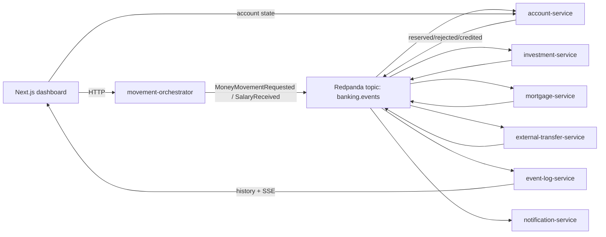

# Agentic Banking Lab

Agentic Banking Lab is a small event-driven banking workshop project for demonstrating agentic programming workflows with OpenCode. It combines Spring Boot, Node.js, Next.js, PostgreSQL, Redpanda, Python tooling, custom OpenCode agents, skills, and commands in one local Docker Compose lab.



## Quickstart

```bash
make up
```

Then open:

```text
http://localhost:3000
```

Useful commands:

```bash
make ps
make logs
make demo-data
make test
make down
```

## Services

| Service | Stack | Port | Purpose |
| --- | --- | ---: | --- |
| web-dashboard | Next.js + React + TypeScript | 3000 | Dashboard, actions, event timeline |
| movement-orchestrator | Node.js 24 + TypeScript | 3001 | Accepts frontend commands and publishes start events |
| event-log-service | Node.js 24 + TypeScript | 3002 | Persists all events and exposes history/SSE |
| notification-service | Node.js 24 + TypeScript | 3003 | Creates notification events from terminal events |
| external-transfer-service | Node.js 24 + TypeScript | 3004 | Handles external transfers after debit reservation |
| account-service | Java 25 + Spring Boot 4 | 8081 | Owns account state, reservations, commits, credits |
| mortgage-service | Java 25 + Spring Boot 4 | 8082 | Handles mortgage repayments |
| investment-service | Java 25 + Spring Boot 4 | 8083 | Handles fund contributions |
| PostgreSQL | postgres | 5432 | Account and event-log persistence |
| Redpanda | Kafka-compatible broker | 9092 | Event transport |
| Redpanda Console | UI | 8080 | Optional broker/topic inspection |

## Demo Flow

1. Start the platform with `make up`.
2. Open the dashboard.
3. Trigger an investment contribution, mortgage repayment, external transfer, salary simulation, and insufficient funds scenario.
4. Watch `banking.events` appear in the timeline and select a correlation ID to inspect the full flow.
5. Run `make demo-data` to generate a richer event stream.

## OpenCode Lab

The repository includes:

- `AGENTS.md` for root agent guidance.
- `.opencode/agents/` for specialized subagents.
- `.opencode/skills/` for reusable engineering guidance.
- `.opencode/commands/` for workshop commands such as `/explain-architecture`, `/add-use-case`, and `/security-review`.

See [docs/OPENCODE_GUIDE.md](docs/OPENCODE_GUIDE.md) and [docs/WORKSHOP_SCRIPT.md](docs/WORKSHOP_SCRIPT.md).

## Known Limitations

This is a controlled workshop lab, not a production bank. It intentionally omits real authentication, authorization, a production-grade ledger, distributed transactions, schema registry, Kubernetes, Terraform, and deep observability.
