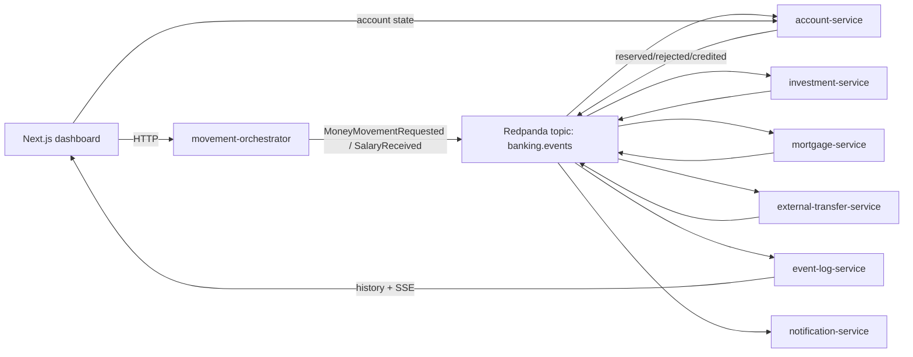

# Agentic Banking Lab

Agentic Banking Lab is a small event-driven banking workshop project for demonstrating agentic programming workflows with OpenCode. It combines Spring Boot, Node.js, Next.js, PostgreSQL, Redpanda, Python tooling, custom OpenCode agents, skills, and commands in one local Docker Compose lab.



## Quickstart

```bash
make up
```

Then open:

```text
http://localhost:3000
```

Useful commands:

```bash
make ps
make logs
make demo-data
make e2e
make test
make down
```

`make demo-data` sends a loose morning scenario into the running platform so the dashboard has richer activity.
`make e2e` starts/rebuilds Docker Compose in the background and runs a strict smoke test through the public HTTP APIs. It verifies service health, deterministic banking flows, event propagation by correlation ID, account balance deltas, released reservations, and random demo activity.
`make test` validates Compose config, TypeScript services, event schemas, the dashboard build, and Java unit tests. The Java Dockerfiles still target Java 25; local Maven tests use `JAVA_TEST_VERSION` with a default of `23` so the workshop repo can be checked on machines that do not have JDK 25 installed.

## Services

| Service                   | Stack                        | Port | Purpose                                              |
| ------------------------- | ---------------------------- | ---: | ---------------------------------------------------- |
| web-dashboard             | Next.js + React + TypeScript | 3000 | Dashboard, actions, event timeline                   |
| movement-orchestrator     | Node.js 24 + TypeScript      | 3001 | Accepts frontend commands and publishes start events |
| event-log-service         | Node.js 24 + TypeScript      | 3002 | Persists all events and exposes history/SSE          |
| notification-service      | Node.js 24 + TypeScript      | 3003 | Creates notification events from terminal events     |
| external-transfer-service | Node.js 24 + TypeScript      | 3004 | Handles external transfers after debit reservation   |
| account-service           | Java 25 + Spring Boot 4      | 8081 | Owns account state, reservations, commits, credits   |
| mortgage-service          | Java 25 + Spring Boot 4      | 8082 | Handles mortgage repayments                          |
| investment-service        | Java 25 + Spring Boot 4      | 8083 | Handles fund contributions                           |
| PostgreSQL                | postgres                     | 5432 | Account and event-log persistence                    |
| Redpanda                  | Kafka-compatible broker      | 9092 | Event transport                                      |
| Redpanda Console          | UI                           | 8080 | Optional broker/topic inspection                     |

## Demo Flow

1. Start the platform with `make up`.
2. Open the dashboard.
3. Trigger an investment contribution, mortgage repayment, external transfer, salary simulation, and insufficient funds scenario.
4. Watch `banking.events` appear in the timeline and select a correlation ID to inspect the full flow.
5. Run `make demo-data` to generate a richer event stream.
6. Run `make e2e` when you want a strict end-to-end verification rather than loose demo activity.

## OpenCode Lab

The repository now treats OpenCode workflow assets as first-class workshop material:

- `AGENTS.md` for root agent guidance.
- `opencode.json` for permissions, formatter configuration, built-in agent overrides, and custom tool safety.
- `.opencode/agents/` for the primary workshop facilitator, visible specialist subagents, and hidden diagnostic subagents.
- `.opencode/skills/` for reusable procedures such as event design, contract drift review, correlation tracing, testing strategy, and workshop facilitation.
- `.opencode/commands/` for repeatable workflows such as `/opencode-map`, `/design-flow`, `/trace-correlation`, `/event-contract-review`, `/security-review`, and `/workshop-readiness`.
- `.opencode/tools/banking.ts` for project-specific OpenCode tools that check health, read events, compare contracts, and trigger guarded demo flows.

See [docs/OPENCODE_GUIDE.md](docs/OPENCODE_GUIDE.md) and [docs/WORKSHOP_SCRIPT.md](docs/WORKSHOP_SCRIPT.md).

## Known Limitations

This is a controlled workshop lab, not a production bank. It intentionally omits real authentication, authorization, a production-grade ledger, distributed transactions, schema registry, Kubernetes, Terraform, and deep observability.
