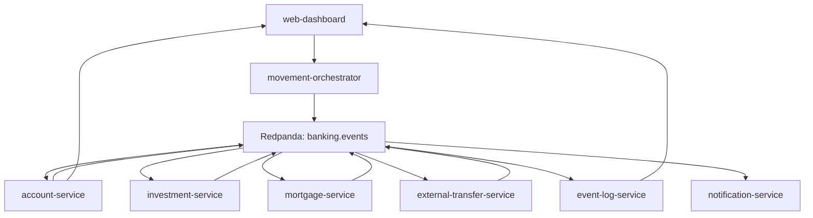

# Architecture

Agentic Banking Lab is an intentionally small event-driven banking platform for agentic programming workshops.

## Service Map

| Service | Responsibility |
| --- | --- |
| `web-dashboard` | Trigger flows, show account state, service health, timeline, and correlation detail. |
| `movement-orchestrator` | Validate frontend requests and publish starting events. |
| `account-service` | Own account state, reserve/commit/release debit amounts, and credit salary income. |
| `investment-service` | Complete or reject investment fund contributions after account reservation. |
| `mortgage-service` | Complete or reject mortgage repayments after account reservation. |
| `external-transfer-service` | Complete or reject external transfers after account reservation. |
| `event-log-service` | Persist every event and expose history plus SSE. |
| `notification-service` | Create user-facing notification events from terminal outcomes. |

## Why It Is Simplified

The lab intentionally avoids production banking complexity. There is one account, one Kafka-compatible topic, minimal persistence, no real auth, and no distributed transaction framework. That keeps the repository small enough for a one-hour workshop while still showing realistic service boundaries and event-driven behavior.
