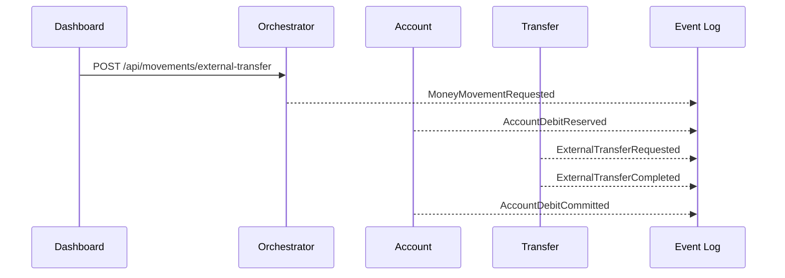

# Events

All services publish JSON events to `banking.events`.

## Envelope

```json
{
  "eventId": "uuid",
  "eventType": "MoneyMovementRequested",
  "eventVersion": 1,
  "occurredAt": "2026-05-05T10:30:00.000Z",
  "producer": "movement-orchestrator",
  "correlationId": "uuid",
  "causationId": null,
  "idempotencyKey": "string-or-null",
  "aggregateId": "acc_main_001",
  "payload": {}
}
```

`correlationId` links the full business flow. `causationId` points to the event that caused a derived event. New event types must be added to `packages/event-contracts/events/envelope.schema.json`.

## Event Types

Start events:
- `MoneyMovementRequested`
- `SalaryReceived`

Account events:
- `AccountDebitReserved`
- `AccountDebitRejected`
- `AccountDebitCommitted`
- `AccountDebitReleased`
- `AccountCredited`

Use-case events:
- `ExternalTransferRequested`
- `ExternalTransferCompleted`
- `ExternalTransferRejected`
- `FundContributionRequested`
- `FundContributionCompleted`
- `FundContributionRejected`
- `MortgageRepaymentRequested`
- `MortgageRepaymentCompleted`
- `MortgageRepaymentRejected`

Notification events:
- `NotificationCreated`

## Example External Transfer



Rejected target-service flows publish `AccountDebitReleased`; insufficient funds publishes `AccountDebitRejected`.
